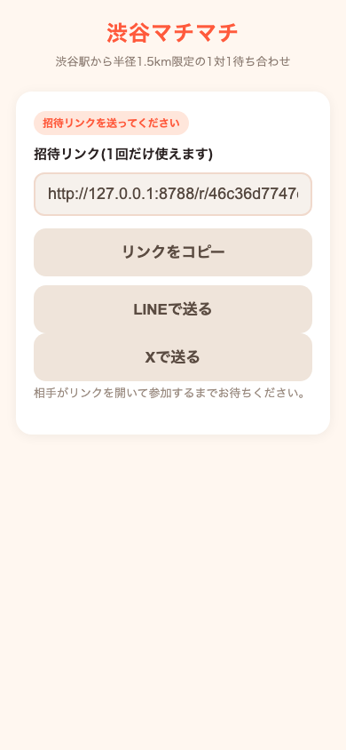
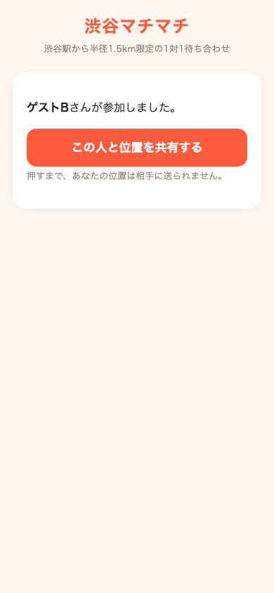
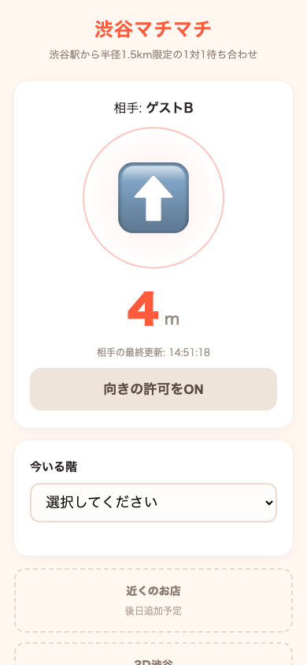

# 渋谷マチマチ (shibuya-machimachi)

[](https://github.com/Ryoseiimai/shibuya-machimachi/actions/workflows/ci.yml)
[](https://codespaces.new/Ryoseiimai/shibuya-machimachi)
[](LICENSE)

渋谷で1対1の待ち合わせを、**お互いが承認した相手とだけ**位置を共有して、迷わず会うためのアプリです。

## スクリーンショット

| 招待リンクを送る | 参加通知を承認する | 距離と方角が届く |
| --- | --- | --- |
|  |  |  |

(スクリーンショットは `npm run dev` のローカル環境と、Playwright E2Eテスト([e2e/tests/flow.spec.js](e2e/tests/flow.spec.js))で自動生成したものです)

## 3分で動かす

Googleアカウントも Cloudflareアカウントも不要です。

```bash
git clone https://github.com/Ryoseiimai/shibuya-machimachi.git
cd shibuya-machimachi
npm run dev   # または: make dev
```

`wrangler dev` をローカルのみ(Miniflare)で起動します。同じURLをブラウザのタブ2つで開けば、
1台のPCでA(ホスト)とB(ゲスト)の両方を再演できます。止めるときは `Ctrl+C`。

ローカルに何もインストールしたくない場合は、上の「Open in GitHub Codespaces」バッジからブラウザだけで同じ開発環境を起動できます。

## 使い方

1. **A(ホスト)がニックネームだけ入力して「待ち合わせを作る」を押す**(アカウント登録は不要)。
2. Aに招待リンクが表示される。コピー・LINE・Xのボタンで**Bに送る**(1回開かれると使えなくなるリンク)。
3. **Bが招待リンクを開き**、Aのニックネームを確認してから自分のニックネームを入力し「承認して参加」を押す。
4. **Aに通知が届き**、「この人と位置を共有する」を押して**Aも承認する**。
5. 両者の承認が揃った瞬間から、**距離(m)と方角の矢印**がお互いの画面に表示される。あわせて今いる階(B5〜10F)を選ぶと「相手は2つ上の階にいます」のように差が出る。
6. 20m以内・同じ階に来たら「会えた！」ボタンで判定できる。どちらかが「共有をやめる」を押せば即座に位置のやり取りは止まる。

## プライバシー設計

- **相互承認が揃うまで、位置の送受信は一切始まらない**。承認前はサーバーも座標を保存しません(`worker/src/room.js` の `updateLocation()`)。
- **1部屋2人まで**。招待リンクは1回使われると無効になり、3人目は「満員」になります。
- どちらかが「共有をやめる」を押すと、**その場で双方の座標を削除**し、以後の位置更新も拒否します。
- 部屋は**3時間で自動終了**し、Durable Objectのストレージごと位置データを削除します。
- **渋谷駅から半径1.5km限定**。エリア外では自分の位置を送信せず「渋谷エリアの外なので共有を止めています」と表示します。
- 相手に渡すのは**距離・方角・フロアの差だけ**。生の座標はWebSocketメッセージ・APIレスポンス・ログのどこにも出しません(`buildPublicState()` が唯一の関所)。
- 「会えた？」判定(TypeSafe AI Jev)に送るのも**距離(m)・同じ階かどうか・経過時間だけ**で、座標やニックネームは送りません。

詳細な線引きは [SECURITY.md](SECURITY.md) を参照してください。

## ロードマップ

今回作ったのは土台(招待リンク→相互承認→リアルタイムの距離と方角)です。画面には次の機能の置き場所(空の枠)だけ用意してあります。

- [ ] **3D渋谷** — [PLATEAU](https://www.mlit.go.jp/plateau/)(国土交通省の3D都市モデル)を使って、渋谷の建物を3Dで表示する
- [ ] **近くのお店** — [OpenStreetMap](https://www.openstreetmap.org/)のデータで、待ち合わせ地点周辺のお店を表示する
- [ ] **上下(フロア)の自動化** — 今は手動選択(B5〜10F)のピッカーのみ。将来は端末の気圧センサーなどから高度を推定し、手動選択と組み合わせる
- [ ] **AR** — カメラ越しに、相手がいる方向へ人影を重ねて表示する
- [ ] **VRメガネ対応** — [WebXR](https://www.w3.org/TR/webxr/)で、VR/ARグラス上でも同じ矢印・距離表示を使えるようにする

## 参加方法 (Contributing)

Issue・PR歓迎です。

- ローカル開発は上の「3分で動かす」を参照(Googleアカウント・Cloudflareアカウント不要)。
- ブランチ・PRの流れは [CONTRIBUTING.md](CONTRIBUTING.md)、行動規範は [CODE_OF_CONDUCT.md](CODE_OF_CONDUCT.md)、受け付けない変更は [SECURITY.md](SECURITY.md) を参照。
- 初めてのコントリビューションに良さそうな小さめの課題には `good first issue` ラベルを付けています。[Issues](https://github.com/Ryoseiimai/shibuya-machimachi/issues) から探してください。
- Claude Code・Codex などAIコーディングエージェントを使う場合は [AGENTS.md](AGENTS.md) / [CLAUDE.md](CLAUDE.md) に構成・起動・テスト方法・守るべき線をまとめています。
- 小さな修正(誤字・翻訳・README改善など)は、Forkしなくても GitHub上のファイル右上の鉛筆アイコンから直接編集提案(PR)を送れます。

## 由来

このアプリは [OG探しゲーム (Ryoseiimai/gmaps-share-finder)](https://github.com/Ryoseiimai/gmaps-share-finder) から進化しました。距離・方角の計算方式や「座標を一切外に出さない」という設計思想を引き継ぎつつ、片方向の鬼ごっこから、**両者が明示的に承認しあう1対1の待ち合わせ**へと作り替えています。

## ライセンス・地図データの出典

- コード本体は **MIT License**([LICENSE](LICENSE)参照)。
- 地図データ・3D都市モデルの出典表記の置き場: 上記ロードマップの「3D渋谷」(PLATEAU, CC BY 4.0)・「近くのお店」(OpenStreetMap, ODbL)を実装する際は、(1)該当する画面枠(`#slot-3d` / `#slot-shops`)の直下に出典クレジットを表示し、(2)このセクションにも出典元とライセンスを追記すること。現時点では地図データは未使用のため、追加のクレジット表記はありません。

---

# Shibuya Machimachi (English)

A 1-on-1 meetup app for Shibuya: share your location only with the person you've **mutually approved**, and find each other without getting lost.

## Screenshots

| Send the invite link | Approve the request | Distance & bearing arrive |
| --- | --- | --- |
|  |  |  |

(Screenshots were captured automatically from the local `npm run dev` environment via the Playwright E2E test, [e2e/tests/flow.spec.js](e2e/tests/flow.spec.js).)

## 3-minute quickstart

No Google account and no Cloudflare account required.

```bash
git clone https://github.com/Ryoseiimai/shibuya-machimachi.git
cd shibuya-machimachi
npm run dev   # or: make dev
```

Starts `wrangler dev` in local-only mode (Miniflare). Open the same URL in two browser tabs to
play both A (host) and B (guest) on one machine. Stop with `Ctrl+C`.

Prefer not to install anything locally? Use the "Open in GitHub Codespaces" badge above to get the same dev environment in your browser.

## How to use it

1. **A (the host) enters only a nickname** and taps "待ち合わせを作る" (Create a meetup) — no account needed.
2. A gets an invite link, with Copy / LINE / X buttons to **send it to B** (the link can only be opened successfully once).
3. **B opens the invite link**, sees A's nickname, enters their own nickname, and taps "承認して参加" (Approve & join).
4. **A is notified** and taps "この人と位置を共有する" (Share location with this person) to **approve too**.
5. The instant both approvals are in, **distance (m) and a direction arrow** appear on both screens. Pick your current floor (B5–10F) to also see a difference like "the other person is 2 floors up."
6. Once within 20m and on the same floor, either side can tap "会えた！" (We met!) to trigger the judgment. Tapping "共有をやめる" (Stop sharing) on either side halts the location exchange immediately.

## Privacy design

- **No location is ever sent or received until both sides have mutually approved.** The server doesn't even store coordinates before that (`updateLocation()` in `worker/src/room.js`).
- **2 people per room, max.** Invite tokens are single-use; a 3rd person gets "full."
- Tapping "stop sharing" **immediately deletes both participants' coordinates** and rejects further updates.
- Rooms **auto-expire after 3 hours**, deleting the entire Durable Object storage (including any location data).
- **Limited to a 1.5km radius from Shibuya Station.** Outside that area, your own position is never sent, and you see "渋谷エリアの外なので共有を止めています" (You're outside Shibuya, so sharing is paused).
- The other person only ever receives **distance, bearing, and floor difference** — raw coordinates never appear in a WebSocket message, API response, or log line (`buildPublicState()` is the single choke point).
- The "did we meet?" judgment (TypeSafe AI Jev) only ever receives **distance (m), same-floor status, and elapsed time** — never coordinates or nicknames.

See [SECURITY.md](SECURITY.md) for the full set of lines this codebase must not cross.

## Roadmap

What's built so far is the foundation (invite link → mutual approval → realtime distance/bearing). The screens already reserve empty slots for what comes next.

- [ ] **3D Shibuya** — render Shibuya's buildings in 3D using [PLATEAU](https://www.mlit.go.jp/plateau/) (Japan's MLIT 3D city model)
- [ ] **Nearby shops** — show shops around the meeting point using [OpenStreetMap](https://www.openstreetmap.org/) data
- [ ] **Automatic floor detection** — today it's a manual B5–10F picker only; later, estimate altitude from device sensors (e.g. barometer) and combine it with manual selection
- [ ] **AR** — overlay a silhouette pointing toward the other person through the camera
- [ ] **VR glasses support** — use [WebXR](https://www.w3.org/TR/webxr/) so the same arrow/distance display works on VR/AR glasses

## Contributing

Issues and PRs are welcome.

- For local dev, see "3-minute quickstart" above (no Google/Cloudflare account needed).
- See [CONTRIBUTING.md](CONTRIBUTING.md) for the branch/PR flow, [CODE_OF_CONDUCT.md](CODE_OF_CONDUCT.md) for community standards, and [SECURITY.md](SECURITY.md) for changes we won't accept.
- Smaller issues suitable for a first contribution are labeled `good first issue` — browse [Issues](https://github.com/Ryoseiimai/shibuya-machimachi/issues).
- Using an AI coding agent (Claude Code, Codex, etc.)? See [AGENTS.md](AGENTS.md) / [CLAUDE.md](CLAUDE.md) for layout, run/test commands, and the lines not to cross.
- For small fixes (typos, translations, README tweaks), you don't even need to fork — use GitHub's pencil ("Edit this file") icon to propose a change directly.

## Origin

This app evolved from [OG探しゲーム (Ryoseiimai/gmaps-share-finder)](https://github.com/Ryoseiimai/gmaps-share-finder). It keeps the same distance/bearing math and the same "coordinates never leave the server" discipline, but rebuilds the one-directional hide-and-seek game into a **1-on-1 meetup where both sides explicitly approve each other**.

## License & map data attribution

- The code is **MIT licensed** (see [LICENSE](LICENSE)).
- Placeholder for map-data attribution: when the roadmap's "3D Shibuya" (PLATEAU, CC BY 4.0) and "Nearby shops" (OpenStreetMap, ODbL) items are implemented, (1) show the credit directly under the relevant slot (`#slot-3d` / `#slot-shops`) in the UI, and (2) add the source and license here too. No map data is used yet, so there is no additional credit to show at this time.
